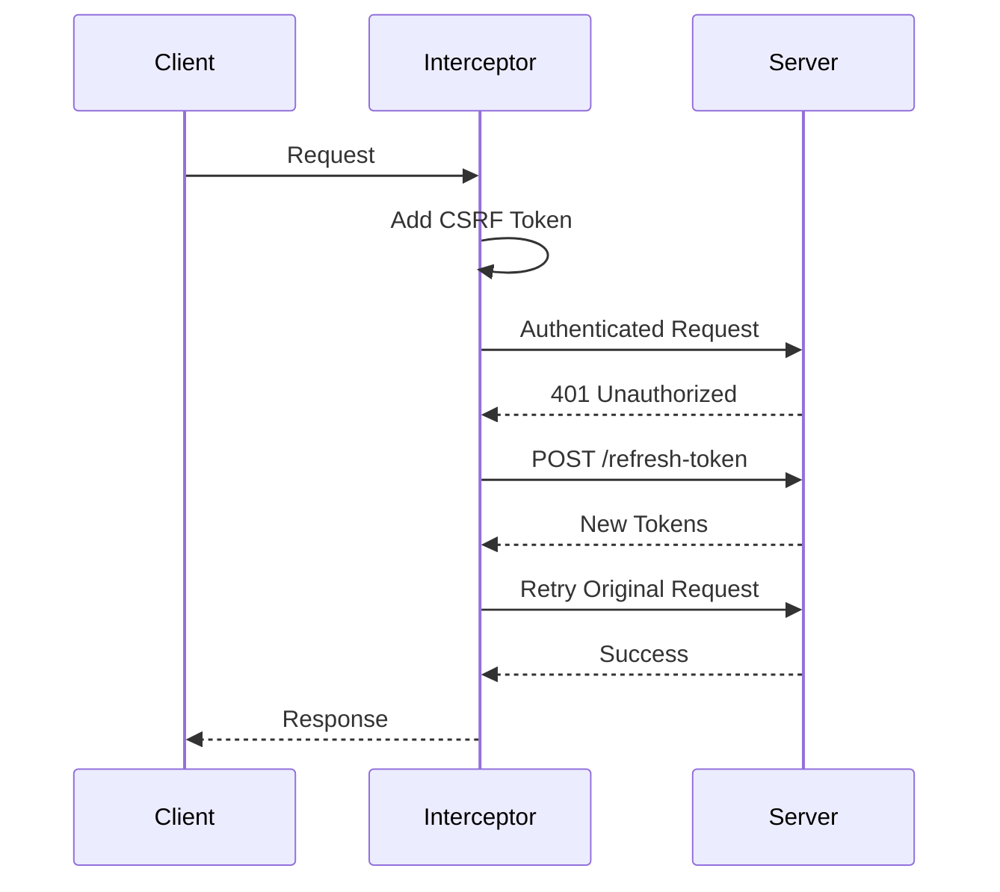

# 🛡️ Secure React Foundation

[](https://github.com/org/repo/actions)
[](https://codecov.io/gh/org/repo)
[](https://www.typescriptlang.org/)
[](LICENSE)

> A security-first React foundation with Feature-Sliced Design architecture

---

## 🚀 Tech Stack

| Category | Technology |
|----------|------------|
| **Framework** | React 19 + TypeScript (Strict Mode) |
| **Build Tool** | Vite 7 |
| **Styling** | TailwindCSS 4 |
| **UI Components** | Shadcn/UI (ready for installation) |
| **HTTP Client** | Axios with CSRF Protection |
| **State Management** | TanStack Query v5 |
| **Validation** | Zod v4 |
| **Testing** | Vitest + Testing Library |
| **Linting** | ESLint with Security Plugin |

---

## 📁 Architecture (Feature-Sliced Design)

```
src/
├── app/                    # Application layer (providers, global config)
├── pages/                  # Page components
├── features/               # Feature modules (auth, dashboard, etc.)
├── entities/               # Business entities (user, product, etc.)
└── shared/                 # Shared utilities
    ├── api/                # Secure Axios client
    ├── config/             # App configuration
    ├── lib/                # Utilities & validation
    ├── types/              # Global TypeScript types
    └── ui/                 # Reusable UI components
```

**Why FSD?** See [ADR-001: Architecture Decision](./docs/adr/001-fsd-security-architecture.md)

---

## 🔐 Security Features

### In-Memory Token Storage

Tokens are stored in JavaScript closures, not localStorage or sessionStorage, preventing XSS attacks from accessing tokens.

### CSRF Protection

Automatic reading of `XSRF-TOKEN` cookie and setting `X-XSRF-TOKEN` header on all requests.

### Automatic Token Refresh

401 responses trigger automatic `/refresh-token` flow with request queuing.

### Zod Validation

All API responses are validated against Zod schemas before use.



---

## ⚡ Quick Start

### Prerequisites

- Node.js 20+
- npm 10+

### Installation

```bash
# Clone the repository
git clone https://github.com/org/repo.git
cd repo

# Install dependencies
npm install

# Start development server
npm run dev
```

### Available Scripts

| Script | Description |
|--------|-------------|
| `npm run dev` | Start development server |
| `npm run build` | Build for production |
| `npm run test` | Run tests in watch mode |
| `npm run test:coverage` | Run tests with coverage |
| `npm run lint` | Lint code |
| `npm run format` | Format code with Prettier |
| `npm run typecheck` | Type check without emitting |

---

## 📖 Documentation

- [Architecture Decision Records](./docs/adr/)
- [Security Guidelines](./docs/SECURITY.md) *(coming soon)*
- [Contributing Guide](./CONTRIBUTING.md) *(coming soon)*

---

## 🧪 Testing

```bash
# Run all tests
npm run test:run

# Run with coverage
npm run test:coverage

# Generate test report
npm run test:report
```

Test reports are generated at `TEST_REPORT.md`, mapping features to their tests and highlighting gaps.

---

## 📝 License

MIT © Your Organization
