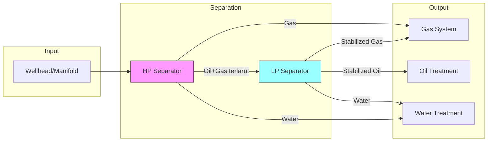
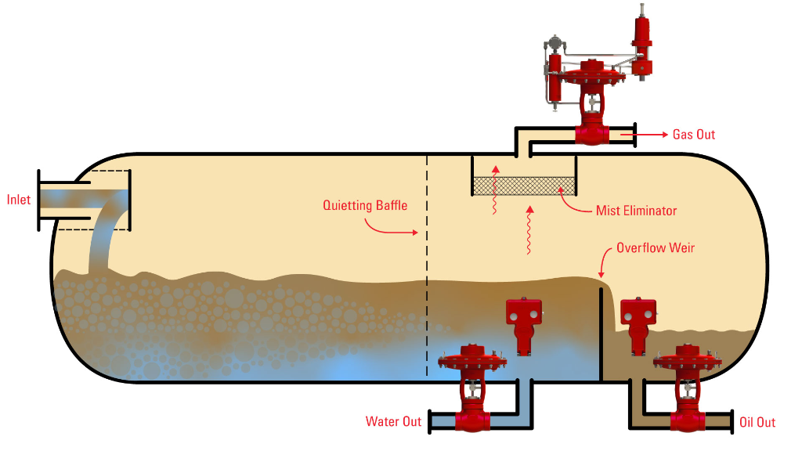
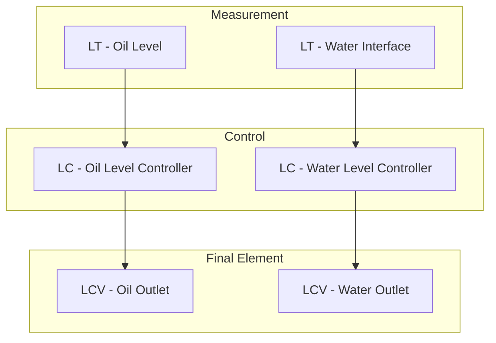
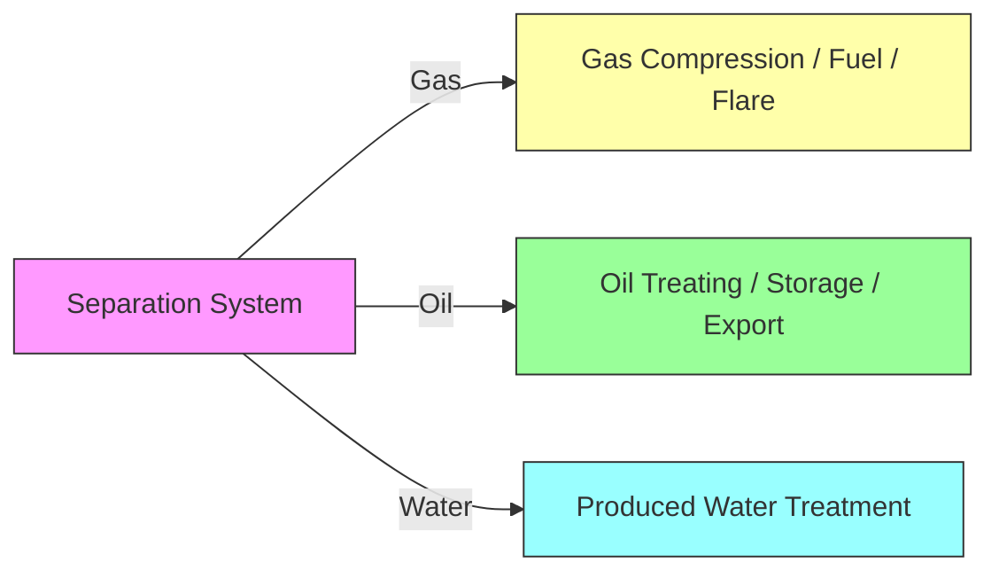

# 🔧 Separation System (The Heart of Process)

Fluida dari wellhead masih berupa **multiphase stream**: minyak, gas, air, plus impuritas (pasir, foam, wax). Separation system bertugas memisahkan fase-fase ini secara **stabil, aman, dan kontinu**.

---

## Overview



---

## Sub-Bagian Utama

### a. Inlet Device / Inlet Diverter

Titik masuk fluida ke separator.

| Fungsi | Deskripsi |
|--------|-----------|
| **Momentum Reduction** | Mengurangi kecepatan aliran yang masuk |
| **Initial Flash** | Memisahkan gas bebas sejak awal |
| **Flow Distribution** | Mendistribusikan aliran secara merata |

> [!IMPORTANT]
> Desain inlet device sangat berpengaruh pada performa separator secara keseluruhan.

---

### b. 3-Phase Separator – High Pressure (HP)

Tahap pertama pemisahan menggunakan prinsip **gravitasi + residence time**.




#### Pemisahan Fase

```
┌─────────────────────────────────────┐
│            GAS SECTION              │ → Gas Outlet (ke Compression/Flare)
├─────────────────────────────────────┤
│            OIL SECTION              │ → Oil Outlet (ke LP Separator/Treatment)
├─────────────────────────────────────┤
│           WATER SECTION             │ → Water Outlet (ke Water Treatment)
└─────────────────────────────────────┘
```

---

### c. Internal Separator Components

| Komponen | Fungsi |
|----------|--------|
| **Mist Extractor / Demister** | Menghilangkan droplet cairan dari gas |
| **Weir Plate** | Memisahkan oil section & water section |
| **Vortex Breaker** | Mencegah entrainment di outlet cairan |
| **Quieting Baffle** | Menenangkan aliran setelah inlet |

---

### d. Low Pressure (LP) Separator


Tahap lanjutan untuk:

- Melepaskan **gas terlarut** dalam minyak
- **Menstabilkan** crude oil sebelum storage
- Biasanya beroperasi pada tekanan **jauh lebih rendah** (~15 psig vs >145 psig)

---

### e. Sand Jetting / Sand Drain System

Mengeluarkan pasir yang mengendap di dasar separator.

> [!WARNING]
> Akumulasi pasir dapat menyebabkan:
>
> - **Erosi** pada internal components
> - **Penurunan volume efektif** separator
> - **False level reading** pada transmitter

---

### f. Chemical Injection Point

| Bahan Kimia | Fungsi |
|-------------|--------|
| **Demulsifier** | Mempercepat pemisahan oil–water emulsion |
| **Anti-foam** | Mencegah gangguan level control akibat busa |
| **Corrosion Inhibitor** | Melindungi internal separator dari korosi |

---

## Automation & Instrumentation

### Level Control (Kritis)



| Instrumen | Fungsi |
|-----------|--------|
| **LT (Level Transmitter)** | Mengukur oil level & water interface level |
| **LCV (Level Control Valve)** | Mengatur outlet oil & water |

> [!CAUTION]
> Salah setting level control dapat menyebabkan **carry-over** (liquid ke gas) atau **carry-under** (oil ke water outlet).

---

### Pressure Control

| Instrumen | Fungsi |
|-----------|--------|
| **PT (Pressure Transmitter)** | Mengukur tekanan separator |
| **PCV (Pressure Control Valve)** | Biasanya di gas outlet, menjaga tekanan stabil |

---

### Temperature Monitoring

| Instrumen | Fungsi |
|-----------|--------|
| **TT (Temperature Transmitter)** | Mendeteksi wax formation & emulsion problem |

---

### Safety System

| Device | Fungsi |
|--------|--------|
| **PSV (Pressure Safety Valve)** | Proteksi terakhir dari overpressure |
| **ESD Interface** | Shutdown otomatis untuk high-high pressure/level |

---

## Failure Modes yang Dijaga oleh Automation

| Failure Mode | Konsekuensi | Proteksi |
|--------------|-------------|----------|
| **Liquid carry-over** | Liquid masuk gas system, merusak compressor | High level alarm + ESD |
| **Gas blow-by** | Gas masuk oil line, cavitation di pump | Level control + interlock |
| **Separator flooding** | Overflow, environmental release | High-high level ESD |
| **Vessel collapse** | Vacuum condition jika outlet blocked | Vacuum relief valve |
| **Overpressure & rupture** | Catastrophic failure | PSV + high-high pressure ESD |

---

## Output Separation System



---

## Referensi & Standar Industri

| Referensi | Deskripsi |
|-----------|-----------|
| **API 12J** | Specification for Oil and Gas Separators |
| **GPSA Engineering Data Book** | Comprehensive separator sizing & design |
| **Arnold & Stewart - Surface Production Operations** | Industri textbook untuk facility design |

---

## Glossary

| Term | Definition |
|------|------------|
| **Carry-over** | Liquid droplets carried into gas outlet |
| **Carry-under** | Oil carried into water outlet |
| **Residence Time** | Time fluid spends inside separator |
| **Demister** | Device to remove liquid mist from gas |
| **Weir** | Internal barrier separating oil and water sections |
| **Emulsion** | Stable mixture of oil and water |
