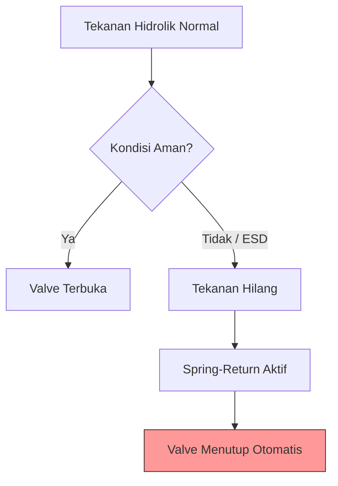
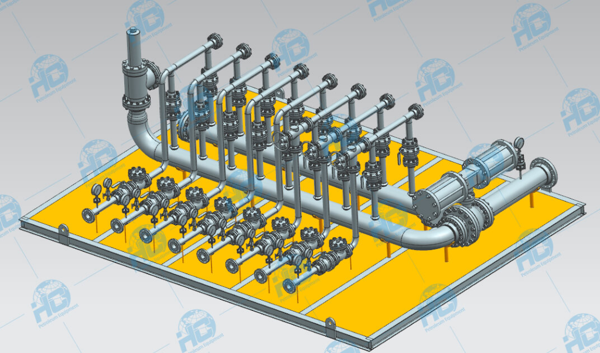
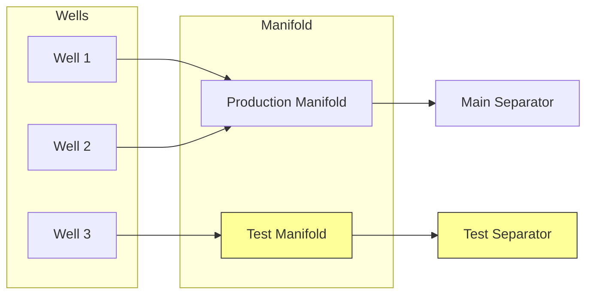
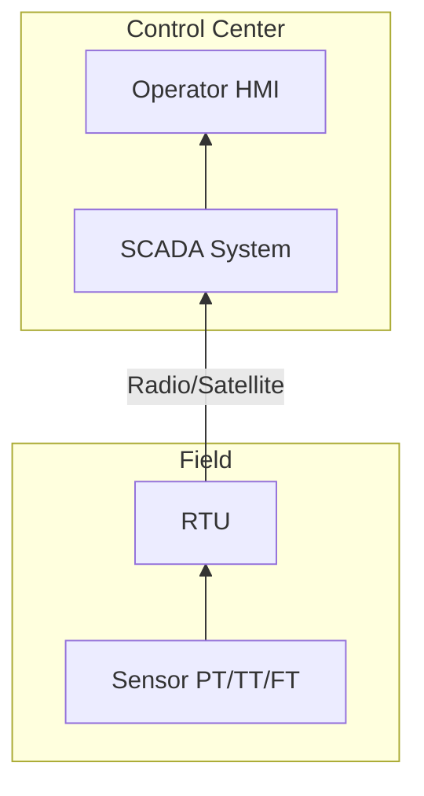

# 🛢️ Oil & Gas Upstream Technical Reference

Dokumentasi teknis untuk memahami komponen-komponen utama dalam fasilitas produksi migas.

---

## 1. Wellhead & Christmas Tree (X-Mas Tree)

Wellhead adalah fondasi permanen di permukaan sumur, sedangkan Christmas Tree adalah susunan katup (valve) yang dipasang di atas wellhead.

### Detail Mekanikal

| Komponen | Fungsi |
|----------|--------|
| **Casing Head** | Menahan beban berat casing |
| **Tubing Head** | Menahan beban tubing dan menyekat tekanan antar anulus |

### Christmas Tree Components


```
┌─────────────────────────┐
│      Swab Valve         │  ← Akses intervensi sumur
├─────────────────────────┤
│      Wing Valve         │  ← Kontrol aliran
├─────────────────────────┤
│     Master Valve        │  ← Katup utama
├─────────────────────────┤
│      Wellhead           │  ← Fondasi permukaan
└─────────────────────────┘
```

> [!IMPORTANT]
> X-Mas Tree adalah **interface subsurface-surface** — titik transisi di mana kontrol reservoir beralih ke kontrol fasilitas permukaan.

---

## 2. Flowline

Jalur pipa yang menghubungkan sumur individual ke fasilitas pengumpul (Manifold/Gathering Station).

### Tantangan Multiphase Flow

Fluida yang mengalir biasanya campuran **minyak, gas, dan air**. Ini menimbulkan tantangan:

- **Slugging** — aliran tidak stabil yang dapat merusak peralatan hilir
- **Wax Deposition** — lilin terbentuk jika suhu turun
- **Hydrate Formation** — kristal es gas dapat menyumbat pipa

### Material Selection

| Material | Aplikasi |
|----------|----------|
| **Carbon Steel** | Standar untuk fluida non-korosif |
| **CRA (Corrosion Resistant Alloy)** | Inconel, Duplex SS untuk H₂S/CO₂ tinggi |

### Flow Diagram


---

## 3. Wellhead Control Panel (WHCP)

"Otak" keselamatan di lokasi sumur.

### Fungsi Utama

- Menggerakkan **Surface Safety Valve (SSV)**
- Menggerakkan **Subsurface Safety Valve (SSSV)**

### Logika Operasi: Fail-Safe



> [!CAUTION]
> Jika tekanan hidrolik/pneumatik hilang (kebocoran atau ESD), valve akan **menutup otomatis** menggunakan kekuatan pegas.

---

## 4. Chemical Injection Point

Injeksi bahan kimia dilakukan sedini mungkin untuk mencegah masalah **Flow Assurance**.

| Bahan Kimia | Fungsi |
|-------------|--------|
| **Corrosion Inhibitor** | Membentuk lapisan film tipis di dinding pipa |
| **Scale Inhibitor** | Mencegah pengendapan mineral (CaCO₃) |
| **Demulsifier** | Membantu memisahkan ikatan air-minyak |

---

## 5. Sand Monitoring System

Pasir adalah **musuh utama** — sifatnya abrasif dan mengikis peralatan.

### Teknologi Deteksi

| Sensor | Metode |
|--------|--------|
| **Acoustic Sensors** | Ultrasonik mendeteksi suara hantaman pasir |
| **Erosion Probes** | Logam tipis yang terkikis mengubah resistansi |

### Mitigasi

> [!WARNING]
> Jika kadar pasir tinggi → **Kurangi laju produksi (choke)** untuk mencegah kebocoran pipa (loss of containment).

---

## 6. Test Line & Manifold

Manifold berfungsi sebagai "stasiun pemilih" untuk mengarahkan aliran.





### Tujuan Well Testing

Mengetahui performa setiap sumur secara individu:

- Berapa **bph** minyak
- Berapa **mmscfd** gas

> Data ini krusial bagi Reservoir Engineer untuk menghitung cadangan migas.

---

## Automation & Instrumentation

### Key Instruments

| Instrumen | Fungsi |
|-----------|--------|
| **MPFM (Multiphase Flow Meter)** | Mengukur minyak, air, gas simultan tanpa pemisahan |
| **PDT (Pressure Differential Transmitter)** | Mendeteksi penyumbatan (plugging) |
| **RTU (Remote Terminal Unit)** | Komputer lapangan → mengirim data ke SCADA |

### Communication Architecture



---

## Referensi & Standar Industri

### Wellhead & Integrity

| Referensi | Deskripsi |
|-----------|-----------|
| Bellarby, J. (2009). *Well Completion Design* | Standar industri untuk interface wellhead |
| **ISO 10423 / API 6A** | Spesifikasi peralatan Wellhead & X-Mas Tree |

### Flow Assurance

| Referensi | Deskripsi |
|-----------|-----------|
| Kelland, M. A. (2014). *Production Chemicals for the Oil and Gas Industry* | Mekanisme inhibitor korosi & scale |
| **SPE-182851-MS** | "A Holistic Approach to Flow Assurance in Subsea Gathering Systems" |

### Sand Monitoring

| Referensi | Deskripsi |
|-----------|-----------|
| **SPE-191530-MS** | "Effective Sand Management: A Key to Maximize Production and Minimize Risk" |

### Digital Oilfield

| Referensi | Deskripsi |
|-----------|-----------|
| Cramer, R., et al. (2012) | "The Intelligent Wells and Fields: Past, Present, and Future" |

---

## Glossary

| Term | Definition |
|------|------------|
| **ESD** | Emergency Shutdown |
| **SSV** | Surface Safety Valve |
| **SSSV** | Subsurface Safety Valve |
| **CRA** | Corrosion Resistant Alloy |
| **MPFM** | Multiphase Flow Meter |
| **RTU** | Remote Terminal Unit |
| **SCADA** | Supervisory Control and Data Acquisition |
| **bph** | Barrels per hour |
| **mmscfd** | Million standard cubic feet per day |
