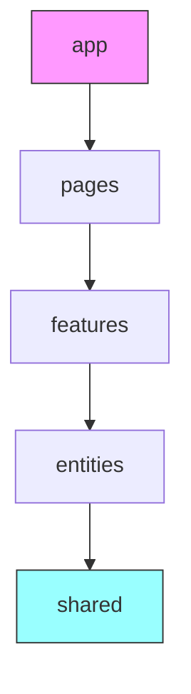

# ADR-001: Feature-Sliced Design with Security-First Approach

## Status

**Accepted** - January 2026

## Context

We are building a React application that needs to:

1. **Scale** - Support a growing team and codebase
2. **Maintain security** - Handle authentication tokens, CSRF protection, and data validation
3. **Be maintainable** - Clear boundaries between modules
4. **Support testing** - Easy to test in isolation

### Problems with Traditional Approaches

| Approach | Issue |
|----------|-------|
| **Flat structure** | Becomes unmaintainable as app grows |
| **Component-based** | Unclear where to put business logic |
| **Atomic Design** | Focused on UI, not business logic |
| **Domain-driven** | Overkill for frontend applications |

## Decision

### 1. Feature-Sliced Design (FSD)

We adopt **Feature-Sliced Design** with the following layers:

```
src/
├── app/          → Providers, global configuration
├── pages/        → Route entry points
├── features/     → Self-contained feature modules
├── entities/     → Business objects
└── shared/       → Reusable utilities
```

**Import Rules:**

- Higher layers can import from lower layers
- Never import upward (shared cannot import from entities)
- Features should not import from other features



### 2. Security-First Token Management

**Decision:** Store tokens in JavaScript closures, not localStorage/sessionStorage.

**Rationale:**

- localStorage is accessible via XSS attacks
- Closures are not accessible from window object
- Refresh tokens handled automatically via interceptors

### 3. CSRF Protection

**Decision:** Implement CSRF protection via cookie-to-header pattern.

**Implementation:**

1. Server sets `XSRF-TOKEN` cookie
2. Client reads cookie and sets `X-XSRF-TOKEN` header
3. Server validates header matches cookie

### 4. Zod Validation

**Decision:** Validate all API responses with Zod schemas.

**Rationale:**

- Runtime type safety for external data
- Clear error messages for invalid responses
- Type inference for TypeScript

## Consequences

### Positive

- ✅ Clear module boundaries
- ✅ Security vulnerabilities prevented by design
- ✅ Easy onboarding with predictable structure
- ✅ Features can be developed in isolation

### Negative

- ⚠️ Initial setup overhead
- ⚠️ May feel restrictive for small projects
- ⚠️ Team needs to learn FSD conventions

### Trade-offs Accepted

| Trade-off | Justification |
|-----------|---------------|
| No localStorage for tokens | Security over convenience |
| Stricter linting | Catch errors early |
| More files/folders | Organization over brevity |

## Compliance

### Security Checklist

- [ ] Tokens stored in memory only
- [ ] CSRF token on all mutations
- [ ] All API responses validated with Zod
- [ ] No sensitive data in localStorage
- [ ] Auth errors trigger session cleanup

## References

- [Feature-Sliced Design](https://feature-sliced.design/)
- [OWASP CSRF Prevention](https://owasp.org/www-community/attacks/csrf)
- [XSS Prevention Cheat Sheet](https://cheatsheetseries.owasp.org/cheatsheets/Cross_Site_Scripting_Prevention_Cheat_Sheet.html)
