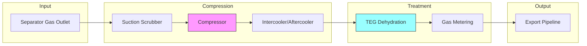
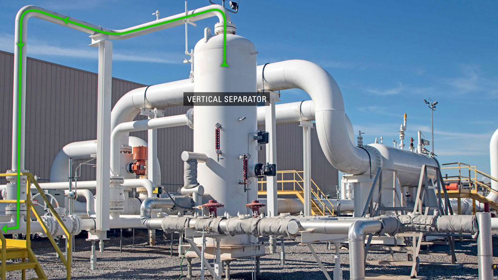
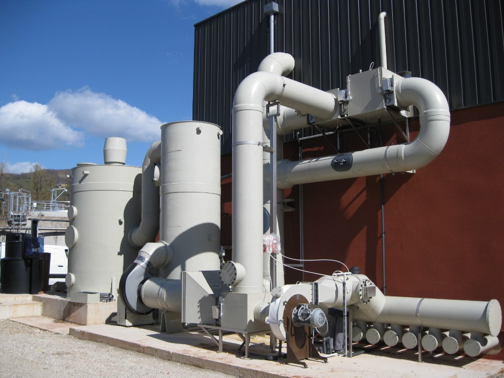
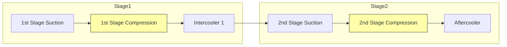
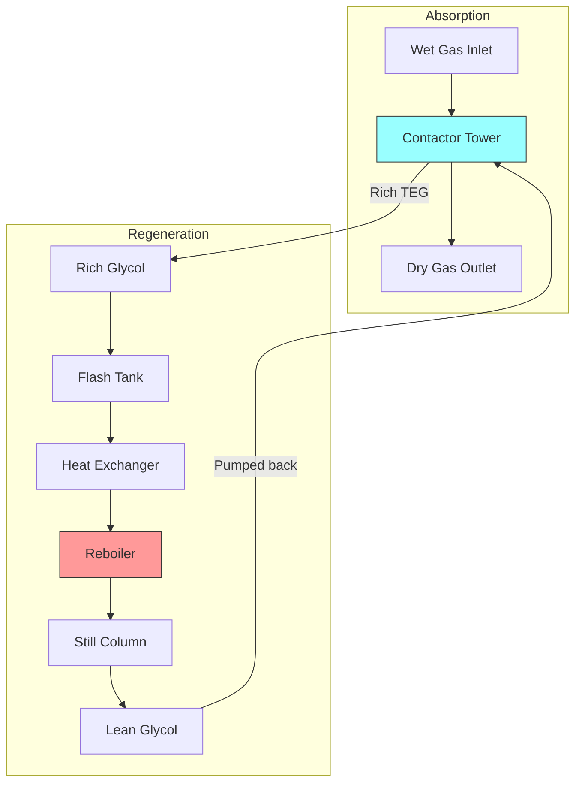
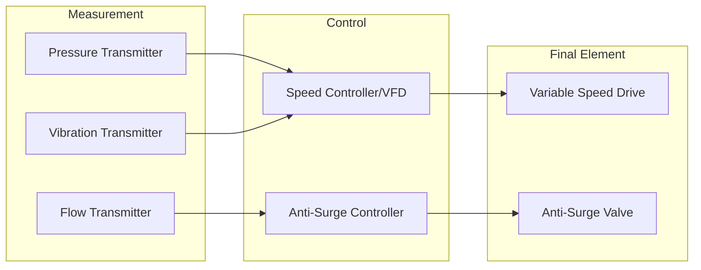
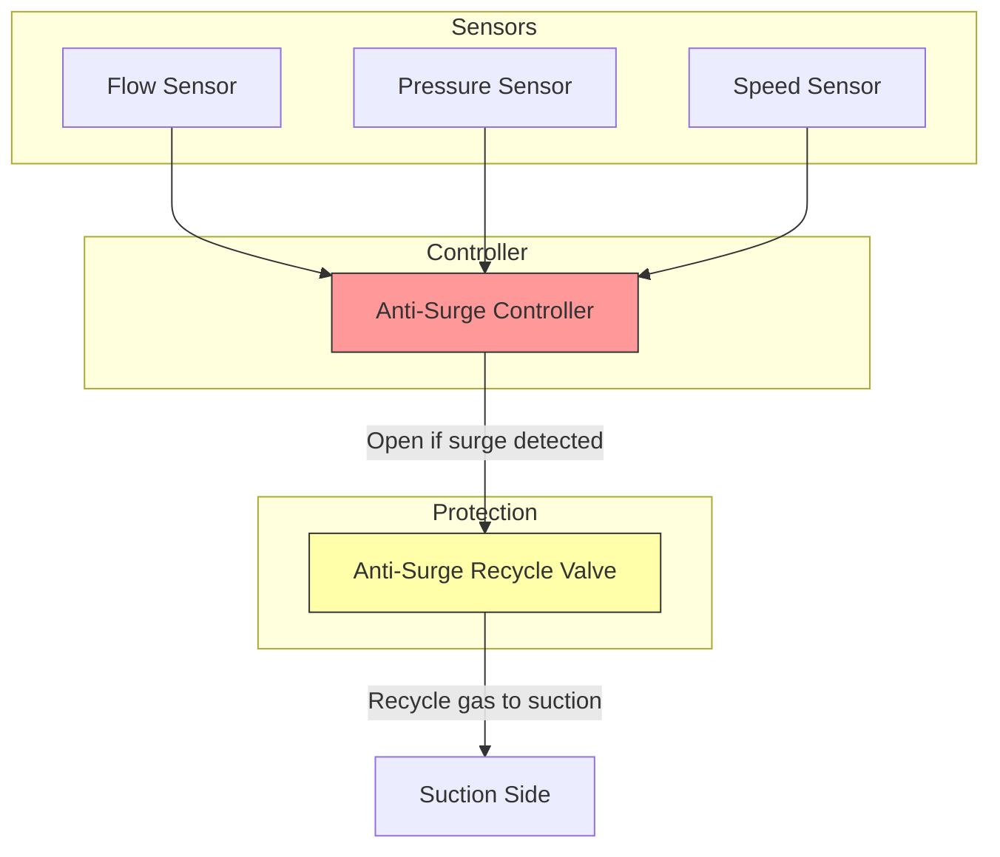
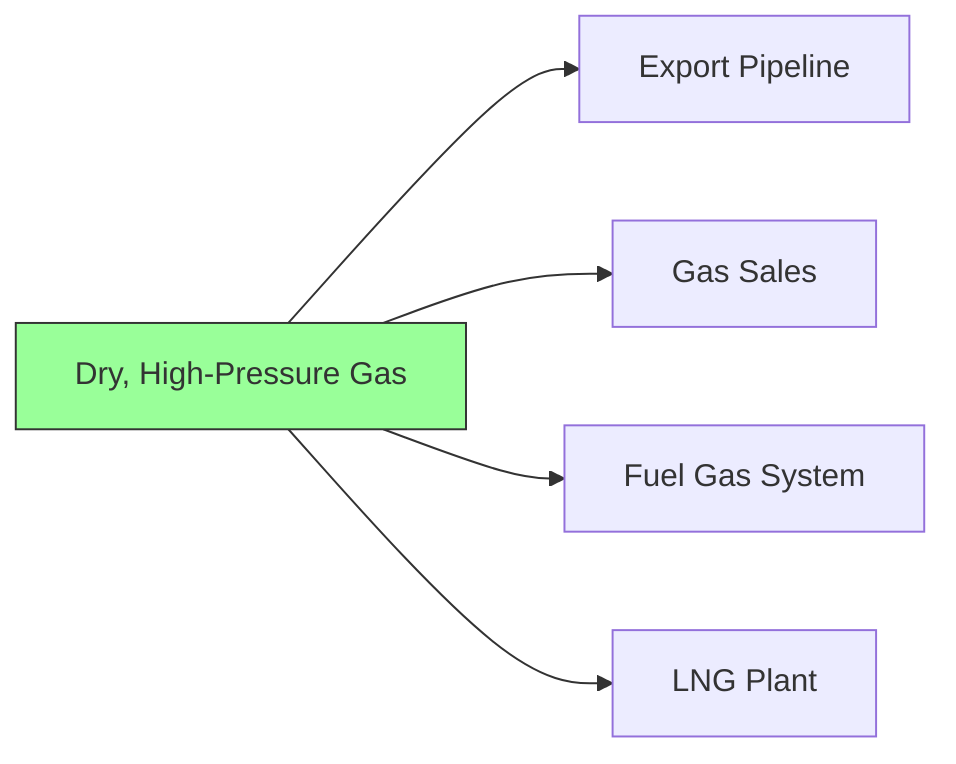

# ⚡ Gas Compression & Treatment

Gas hasil separasi belum siap dikirim karena masih:

- Mengandung **cairan & uap air**
- **Bertekanan rendah**
- Berpotensi merusak pipa & peralatan downstream

Sistem ini bertugas **membersihkan, mengeringkan, dan menaikkan tekanan gas** secara aman dan kontinu.

---

## Overview

---

## Sub-Bagian Utama

### a. Inlet Scrubber / Suction Scrubber

Peralatan **wajib** sebelum kompresor.

| Fungsi                    | Deskripsi                                        |
| ------------------------- | ------------------------------------------------ |
| **Liquid Removal**        | Menghilangkan liquid carry-over dari separator   |
| **Particle Capture**      | Menangkap partikel padat yang tersisa            |
| **Compressor Protection** | Melindungi impeller, seal, dan bearing kompresor |

> [!CAUTION]
> Liquid ingestion ke kompresor dapat menyebabkan **instant failure** — kerusakan impeller dan bearing dalam hitungan detik.

---

### b. Gas Compressor

Umumnya **centrifugal compressor** untuk offshore & large flow.

| Aspek         | Detail                                          |
| ------------- | ----------------------------------------------- |
| **Tipe**      | Single-stage atau multi-stage                   |
| **Penggerak** | Motor listrik atau Gas turbine                  |
| **Fungsi**    | Menaikkan tekanan gas untuk pipeline/processing |

#### Compression Stages

---

### c. Intercooler / Aftercooler

Pendingin gas antar atau setelah kompresi.

| Fungsi                                 | Benefit                         |
| -------------------------------------- | ------------------------------- |
| **Menurunkan temperatur gas**          | Meningkatkan efisiensi kompresi |
| **Mengurangi beban kompresor**         | Tahap berikutnya lebih ringan   |
| **Mengurangi risiko degradasi glycol** | TEG tidak rusak karena panas    |

---

### d. Dehydration Unit – TEG System

Menghilangkan uap air dari gas menggunakan **Tri-Ethylene Glycol (TEG)**.

#### Komponen Utama

| Komponen                     | Fungsi                                            |
| ---------------------------- | ------------------------------------------------- |
| **Contactor Tower**          | Tempat kontak gas dengan TEG untuk menyerap air   |
| **Glycol Regeneration Unit** | Memanaskan TEG untuk melepaskan air yang terserap |
| **Reboiler**                 | Sumber panas untuk regenerasi glycol              |
| **Still Column**             | Memisahkan air dari glycol                        |

#### Proses TEG Dehydration

> [!IMPORTANT]
> TEG dehydration mencegah:
>
> - **Korosi pipa**
> - **Hydrate formation** di pipeline bawah laut
> - **Slug flow** akibat kondensasi

---

### e. Glycol Circulation System

| Komponen          | Fungsi                                              |
| ----------------- | --------------------------------------------------- |
| **TEG Pump**      | Mensirkulasi glycol antara contactor & regeneration |
| **Filters**       | Menyaring partikel & kontaminan dari glycol         |
| **Flash Tank**    | Melepaskan gas terlarut dari rich glycol            |
| **Carbon Filter** | Menghilangkan hydrocarbon yang terlarut             |

---

### f. Gas Metering (Export Meter)

Pengukuran **custody transfer** — sangat kritikal secara komersial.

| Tipe Meter           | Aplikasi                       |
| -------------------- | ------------------------------ |
| **Ultrasonic Meter** | High accuracy, no moving parts |
| **Orifice Meter**    | Traditional, well-understood   |
| **Coriolis Meter**   | Mass flow measurement          |

> [!NOTE]
> Data dari gas meter adalah basis untuk **revenue calculation** dan kontrak penjualan gas.

---

## Automation & Control System

### Compressor Control

#### VFD / Speed Controller

| Fungsi                   | Deskripsi                                  |
| ------------------------ | ------------------------------------------ |
| Mengatur kecepatan motor | Menyesuaikan dengan flow & pressure demand |
| Energy optimization      | Mengurangi konsumsi daya saat beban rendah |

---

### Anti-Surge Control System

**Sistem proteksi utama kompresor** — mencegah aliran balik, getaran ekstrem, dan kerusakan impeller.

> [!CAUTION]
> **Surge** adalah kondisi di mana aliran balik terjadi di dalam kompresor. Tanpa proteksi, surge dapat merusak kompresor dalam hitungan menit.

---

### Pressure & Flow Control

| Instrumen                        | Fungsi                              |
| -------------------------------- | ----------------------------------- |
| **PT (Pressure Transmitter)**    | Monitor tekanan suction & discharge |
| **FT (Flow Transmitter)**        | Monitor flow rate untuk anti-surge  |
| **PCV (Pressure Control Valve)** | Menjaga tekanan discharge stabil    |

---

### Dehydration Control

| Parameter                | Monitoring                         |
| ------------------------ | ---------------------------------- |
| **Water Content**        | Gas outlet harus < 7 lb/mmscf      |
| **TEG Concentration**    | Harus > 99% untuk efektif          |
| **Reboiler Temperature** | 375-400°F untuk regenerasi optimal |

> [!WARNING]
> Jika water content melebihi spec → **Alarm** dan potensi hydrate formation downstream.

---

### Safety & Shutdown

| Proteksi                 | Kondisi Trip                                      |
| ------------------------ | ------------------------------------------------- |
| **High Vibration**       | Kerusakan bearing atau unbalance                  |
| **High Temperature**     | Overheating motor/gas                             |
| **Fire & Gas Detection** | Kebocoran gas atau kebakaran                      |
| **ESD Integration**      | Terintegrasi dengan upstream & downstream systems |

---

## Risiko yang Dikendalikan Sistem Ini

| Risiko                    | Konsekuensi                       | Proteksi                                 |
| ------------------------- | --------------------------------- | ---------------------------------------- |
| **Compresor Surge**       | Kerusakan impeller, seal, bearing | Anti-surge control system                |
| **Liquid Ingestion**      | Instant compressor failure        | Inlet scrubber + high-level trip         |
| **Hydrate Plugging**      | Blockage di pipeline laut         | TEG dehydration + temperature monitoring |
| **Overpressure Pipeline** | Rupture risk                      | PCV + PSV + ESD                          |
| **Off-spec Gas Export**   | Contract violation, penalties     | Water content analyzer + alarm           |

---

## Output Akhir

Gas keluar dari sistem ini dalam kondisi:

| Parameter            | Kondisi                                |
| -------------------- | -------------------------------------- |
| **Moisture Content** | Dry gas (< 7 lb/mmscf)                 |
| **Pressure**         | High pressure (sesuai pipeline spec)   |
| **Quality**          | Siap dikirim ke darat / plant lanjutan |

---

## Referensi & Standar Industri

| Referensi                      | Deskripsi                                               |
| ------------------------------ | ------------------------------------------------------- |
| **API 617**                    | Axial and Centrifugal Compressors                       |
| **API 618**                    | Reciprocating Compressors                               |
| **GPSA Engineering Data Book** | Gas processing & compression design                     |
| **API 14C**                    | Recommended Practice for Analysis, Design, Installation |

---

## Glossary

| Term                 | Definition                                                   |
| -------------------- | ------------------------------------------------------------ |
| **Surge**            | Unstable operating condition with reverse flow in compressor |
| **TEG**              | Tri-Ethylene Glycol, dehydration agent                       |
| **Contactor**        | Vessel where gas contacts glycol for water absorption        |
| **Reboiler**         | Heat source for glycol regeneration                          |
| **Custody Transfer** | Official handover point for measurement & billing            |
| **VFD**              | Variable Frequency Drive                                     |
| **mmscf**            | Million Standard Cubic Feet                                  |
| **lb/mmscf**         | Pounds per million standard cubic feet (water content unit)  |
