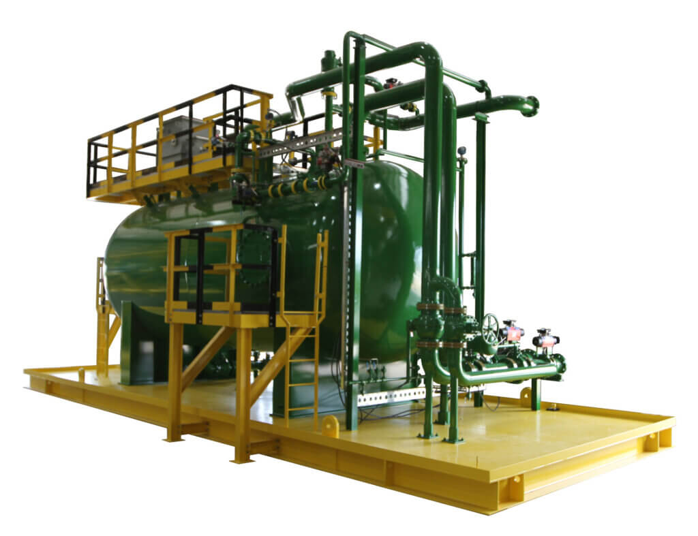
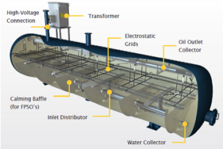
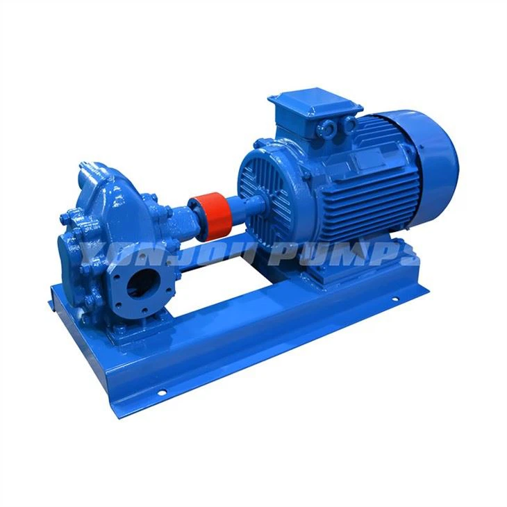

# 4. Oil Treatment & Export – Expanded

Minyak hasil separasi belum otomatis layak jual. Masih mengandung:

- Air terdispersi
- Sedimen
- Emulsi stabil

Tahap ini memastikan crude oil memenuhi spesifikasi kontrak sebelum disimpan atau diekspor.

## 🔧 Sub-Bagian Utama (Lengkap Lapangan)

### a. Heater / Heater Treater (jika diperlukan)

- Menaikkan temperatur minyak
- Menurunkan viskositas
- Membantu pemisahan oil–water lebih efektif

### b. Electrostatic Coalescer / Electrostatic Treater

- Menggunakan tegangan tinggi
- Menyebabkan droplet air:
  - Bergabung (coalesce)
  - Mengendap ke bawah
- Sangat efektif untuk emulsi halus

### c. Chemical Injection (Demulsifier)

- Memecah ikatan emulsi
- Mengurangi beban electrostatic treater
- Titik injeksi biasanya sebelum treater

### d. Oil Surge / Buffer Tank

- Menstabilkan aliran sebelum ekspor
- Memberi waktu respon pada pompa & kontrol

### e. Oil Export Pumps

- Pompa berkapasitas besar (centrifugal / PD)
- Mengirim minyak ke:
  - Pipeline
  - Floating Storage (FSO)
  - Shuttle tanker
- Biasanya dilengkapi:
  - Standby pump
  - Minimum flow recycle

### f. Fiscal Metering Skid

- Titik custody transfer
- Mengukur:
  - Volume
  - Flow rate
  - Density
  - Temperature
- Data ini = dasar penagihan & revenue

## 🎛 Automation & Instrumentation (Sangat Kritis)

### Quality Control

- **BS&W Analyzer**: Mengukur kandungan air & sedimen. Alarm jika off-spec.
- **Water Cut Monitoring**: Proteksi agar air tidak ikut terjual 😅

### Flow Measurement

- **Flow Meter (Coriolis / Ultrasonic)**
  - Digunakan untuk:
    - Produksi harian
    - Laporan lifting
    - Perhitungan penjualan

### Pump Control

- Start/stop otomatis
- Monitoring:
  - Discharge pressure
  - Vibration
  - Temperature
- Trip jika:
  - Low suction
  - Overpressure
  - Seal failure

### Level Control

- **LT & LCV di treater**
- Menjaga:
  - Oil–water interface stabil
  - Tidak terjadi water carry-over

### Safety & Interlock

- High-high level → export pump trip
- Off-spec oil → divert ke reprocess
- ESD terintegrasi dengan tank & pipeline

## ⚠️ Risiko yang Dijaga Sistem Ini

- Air terjual sebagai minyak (financial loss)
- Korosi pipeline export
- Penolakan cargo oleh buyer
- Pump cavitation & failure
- Dispute custody transfer

## 🎯 Output Akhir

Minyak keluar dari sistem ini dalam kondisi:

- BS&W rendah (sesuai spesifikasi)
- Stabil secara flow & pressure
- Tercatat secara legal & komersial
- Siap disimpan atau dikapalkan
