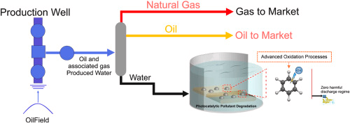
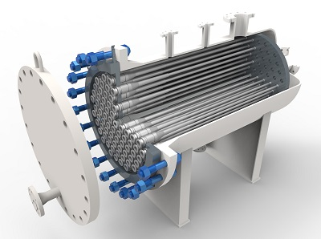
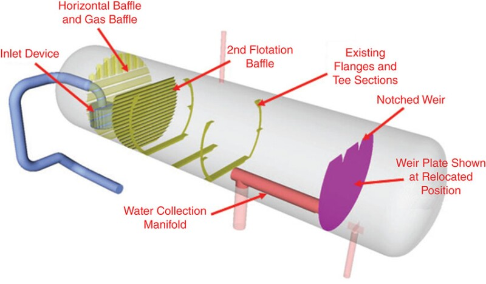

# 5. Produced Water Treatment (Waste Management) – Expanded

Produced water adalah volume terbesar yang dihasilkan fasilitas produksi.
Walaupun “limbah”, air ini wajib diolah sebelum dibuang atau diinjeksi ulang.

## 🔧 Sub-Bagian Utama (Lengkap & Lapangan)

### a. Produced Water Feed Tank / Buffer

- Menstabilkan aliran dari separator
- Mengurangi fluktuasi beban sistem downstream

### b. Hydrocyclone

- Tahap pemisahan utama
- Prinsip:
  - Gaya sentrifugal
  - Minyak → overflow
  - Air → underflow
- Efektif untuk droplet minyak ukuran kecil

### c. Induced Gas Flotation (IGF) / Compact Flotation Unit (opsional)

- Digunakan jika spesifikasi sangat ketat
- Menggunakan gelembung gas untuk mengangkat minyak ke permukaan
- Umum di fasilitas offshore modern

### d. Produced Water Degasser

- Menghilangkan:
  - Sisa gas terlarut
  - H₂S / hidrokarbon ringan
- Melindungi:
  - Pompa
  - Pipa overboard
  - Personel

### e. Polishing System (jika ada)

- Media filter / nutshell filter
- Tahap terakhir sebelum pembuangan
- Menjamin Oil-in-Water sangat rendah

### f. Overboard / Disposal Line

- Jalur pembuangan ke laut
- Dilengkapi:
  - Non-return valve
  - Isolation valve
  - Sampling point

## 🎛 Automation & Instrumentation (Regulatory-Critical)

### Oil-in-Water Monitoring

- **OIW Analyzer**
  - Online & continuous
  - Alarm & interlock jika:
    - batas regulasi (mis. 30 ppm)

### Flow & Pressure Monitoring

- **FT & PT**
- Menjaga stabilitas hydrocyclone
- Mendeteksi plugging / fouling

### Level Control

- **LT pada tank & degasser**
- Mencegah:
  - Overflow
  - Gas carry-under

### Environmental Interlock

- Jika OIW > limit:
  - Automatic divert
  - Shutdown overboard
  - Recycle ke inlet treatment

## ⚠️ Risiko yang Dikendalikan Sistem Ini

- Pelanggaran regulasi lingkungan
- Pencemaran laut
- Shutdown paksa oleh regulator
- Reputasi perusahaan rusak
- Korosi & gas hazard

## 🎯 Output Akhir

Produced water keluar dari sistem ini dalam kondisi:

- Oil content < batas regulasi
- Gas-free
- Aman untuk dibuang atau diinjeksi
