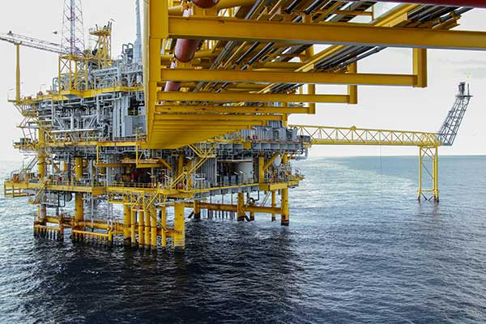

# 6. Utility & Safety Systems (Support) – Expanded

Utility & Safety Systems tidak menghasilkan minyak atau gas, tapi tanpa ini seluruh platform tidak bisa beroperasi—atau lebih parah: tidak aman.

## 🔧 Sub-Bagian Utama (Lengkap & Operasional)

### a. Power Generation System

- Sumber listrik utama platform
- Umumnya:
  - **Gas Turbine Generator**: Menggunakan fuel gas dari proses
- Dilengkapi:
  - Main generator
  - Standby / emergency generator
- Menyuplai:
  - Process equipment
  - Control system
  - Living quarters

### b. Electrical Distribution System

- Switchgear
- Transformer
- MCC (Motor Control Center)
- UPS & Battery system (untuk kontrol & keselamatan)

### c. Instrument Air System

- Kompresor udara + air dryer
- Menyediakan udara bersih & kering untuk:
  - Control valve pneumatik
  - Actuator
  - Instrumentasi
- Biasanya ada backup nitrogen untuk kondisi darurat

### d. Fuel Gas System

- Mengatur suplai gas ke:
  - Gas turbine
  - Heater
- Termasuk:
  - Pressure control
  - Filtration
  - Safety shutoff valve

### e. Fire Water System

- Fire water pumps (diesel & electric)
- Fire water ring main
- Deluge system, hydrant, monitor
- Siap aktif otomatis saat kebakaran

## 🔥 Fire & Gas (F&G) System

Sistem deteksi dini untuk melindungi personel & aset.

### Deteksi

- **Gas Detector**
  - H₂S (toxic)
  - CH₄ / HC (flammable)
- **Fire Detector**
  - Flame
  - Heat
  - Smoke

### Aksi Otomatis

- Alarm visual & audible
- Aktivasi deluge
- Trip peralatan
- Trigger ESD / blowdown

## 🎛 Automation & Control Architecture (Kunci Keselamatan)

### BPCS (Basic Process Control System)

- Mengontrol operasi normal:
  - Flow
  - Level
  - Pressure
- Fokus: operability & efficiency

### SIS (Safety Instrumented System)

- Sistem independen & terpisah secara logika
- Fokus: proteksi nyawa & aset
- Melakukan:
  - **Emergency Shutdown (ESD)**
  - **Process Shutdown (PSD)**
- Berdasarkan:
  - SIL (Safety Integrity Level)

### ESD System

- Mengisolasi:
  - Sumur
  - Separator
  - Export line
- Menghentikan proses secara aman & berurutan

### Blowdown System

- Melepaskan tekanan proses ke flare
- Mengurangi energi saat kondisi darurat

## ⚠️ Prinsip Kritis yang Dijaga

- Independensi SIS dari BPCS
- Fail-safe philosophy
- No single point of failure
- Redundancy (N+1)

## 🎯 Fungsi Utama Utility & Safety Systems

- Menjaga platform tetap hidup (power & utilities)
- Menjamin operasi stabil & terkendali
- Melindungi:
  - Personel
  - Lingkungan
  - Aset bernilai tinggi
- Memastikan kepatuhan terhadap standar internasional (IEC, API, ISO)
